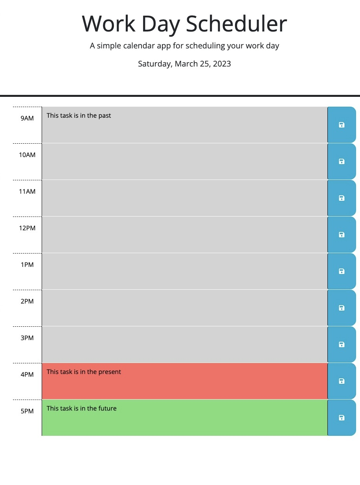

# Ever Muniz // Work Day Scheduler

## Description

I was provided with some beginning code to create a work day scheduler. The purpose is to help users input their tasks by hour for that day. The time slots are color coded so they will dynamically change throughout the day leting you know which tasks are in the past, present, or future hours. The CSS code was unmodified and I made a few modifications to the HTML code. I primarily used JavaScript and JQuery to achieve the desired functionality. I used the day.js library for dates and times which allows the application to update the date in the header and div styles dynamically.

## Usage

- Upon opening the planner, you will notice today's date in the header
- You will notice 9 slots from 9am - 6pm
- To help organize your daily tasks by hour, click into the respective time's text area and input your tasks
- Click save to save the tasks in local storage which will allow you to view them later even if you leave the page
- The tasks are color coded to represent whether a task is in the past, present, or future hours

[Click on this link to visit the deployed application](https://evermuniz.github.io/Ever-Muniz-Work-Day-Scheduler/)

## Credits

- HTML, CSS, and initial JavaScript code provided by the University of Utah Coding Bootcamp
- HTML uses Bootstrap library for HTML layout and positioning
- Day.js library is used for dates and times
- Font Awesome and Google Fonts libraries are used in webpage 
- JQuery library is used in the script.js file
- References used to build the JavaScript & JQuery code was provided by the U of U Coding Bootcamp and various online sources

## License

Refer to license in repo